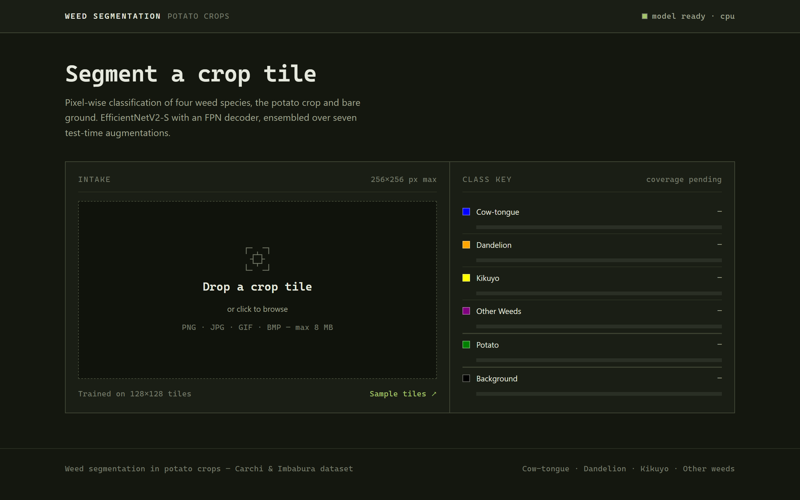
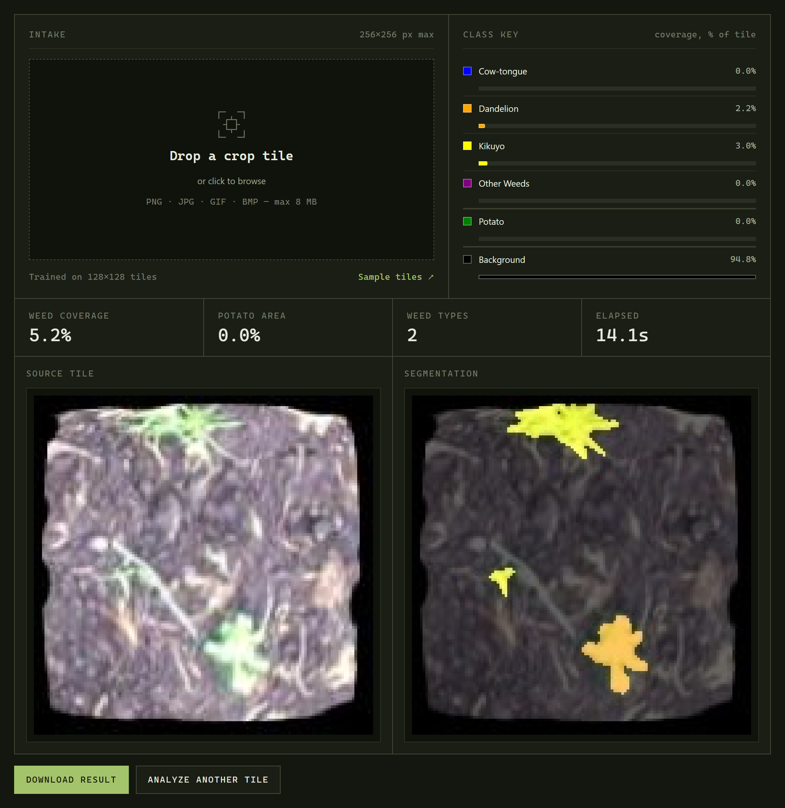
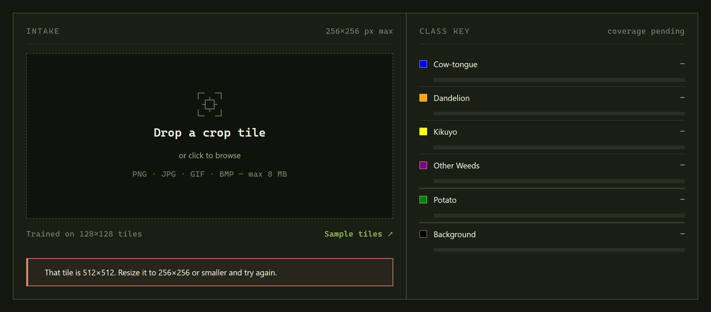

# 🌱 Automatic Weed Segmentation in Potato Crops

## 📋 Description

Deep learning system for identifying and segmenting weeds in potato crops. It uses a custom Feature
Pyramid Network (FPN) with an EfficientNetV2-S backbone, attention modules, ASPP and Test-Time
Augmentation, served through a Flask web interface.

**Live app: <https://appweedsegmentantion.azurewebsites.net/>** — deployed on Azure App Service,
inference on CPU. The pill in the masthead mirrors `/health`, so you can see whether the checkpoint
loaded before you upload anything.



## 🎯 Features

- **Multi-class segmentation**: 6 classes covering the potato crop and 4 weed types
- **Test-Time Augmentation**: 7 augmentation variants ensembled in a single batched forward pass
- **Web interface**: Flask app with a Tailwind CSS front end and an animated segmentation reveal
- **Per-class statistics**: pixel distribution and crop/weed coverage metrics
- **Result download**: export the processed overlay
- **Structured logging**: JSON logs with request IDs and per-request timings

## 🔬 Detection Classes

| Class | Description | Overlay color |
|-------|-------------|---------------|
| **Background** | Soil and background | Black |
| **Cow-tongue** | Common broadleaf weed | Blue |
| **Dandelion** | Perennial weed | Orange |
| **Kikuyo** | Invasive grass | Yellow |
| **Other Weeds** | Remaining weed species | Purple |
| **Potato** | Main crop | Green |

Colors are defined once in `CLASS_COLORS` (`weed_predictor.py`), in BGR because OpenCV renders the overlay.

## 🖼️ Interface

Drop a tile into the intake panel and the readout appears below it: the class key on the right fills
in with per-class coverage, the metric row summarises the tile, and the overlay is wiped over the
source image with a clip-path reveal.



Above is a 128×128 test tile from the Carchi & Imbabura dataset. The model marked 3.0 % kikuyo
(yellow) and 2.2 % dandelion (orange) — 5.2 % weed coverage across two weed types, no potato in
this tile — and returned in 14.1 s end to end on the deployed CPU instance, all seven test-time
augmentations included.

## 🚀 Quick start with Docker

Docker is the supported path: the image pins Python 3.11 and the CPU builds of torch.

```bash
# Build (bakes in only the checkpoint that is actually served)
docker build -t weed-segmentation:latest .

# Run
docker run -d --name weed-app -p 5000:5000 weed-segmentation:latest
```

The app is available at `http://localhost:5000`. Check readiness with:

```bash
curl http://localhost:5000/health
```

### With Nginx (docker compose)

```bash
docker compose up -d          # app + nginx reverse proxy on http://localhost:8080
docker compose logs -f
docker compose down
```

## 🐍 Local installation

**Requires Python 3.11.** `requirements.txt` pins `torch==2.0.1`, which publishes no wheels for
Python 3.12 or newer — installing on 3.12+ will fail.

```bash
python3.11 -m venv .venv
source .venv/bin/activate           # Windows: .venv\Scripts\activate

# CPU-only torch (skip if you want the CUDA build)
pip install torch==2.0.1+cpu torchvision==0.15.2+cpu --index-url https://download.pytorch.org/whl/cpu
pip install -r requirements.txt

python app.py
```

### Tailwind CSS

The compiled stylesheet is committed at `static/dist/output.css`. Rebuild it only if you edit
`static/src/input.css`:

```bash
npm install
npx @tailwindcss/cli -i ./static/src/input.css -o ./static/dist/output.css --watch
```

### Model checkpoint

Place the trained checkpoint in `models/`. The default is:

```
models/
└── weed_segmentation_S-TTA.pth
```

Point `MODEL_PATH` elsewhere to serve a different checkpoint, or pass `--build-arg MODEL_FILE=...`
to bake another one into the image.

> **Note:** the checkpoints are ~90 MB each and are committed directly to git, without Git LFS.

## ⚙️ Configuration

Every setting is read from the environment. See `.env.example` for the full list with defaults.

| Variable | Default | Description |
|----------|---------|-------------|
| `MODEL_PATH` | `models/weed_segmentation_S-TTA.pth` | Checkpoint to load |
| `DEMO_MODE` | `0` | Serve placeholder masks if the model fails to load. **Off in production** |
| `HOST` / `PORT` | `0.0.0.0` / `5000` | Bind address (dev server only) |
| `MAX_UPLOAD_MB` | `8` | Upload size limit, enforced server-side and shown in the UI |
| `MAX_IMAGE_DIM` | `256` | Maximum accepted width/height in pixels |
| `MIN_IMAGE_DIM` | `32` | Minimum accepted width/height in pixels |
| `RESULT_TTL_MINUTES` | `60` | Age at which result images are purged. `0` disables cleanup |
| `UPLOAD_FOLDER` / `RESULTS_FOLDER` | `uploads` / `results` | Working directories |
| `LOG_FILE` | `logs/app.log` | Rotating JSON log |
| `LOG_MAX_BYTES` / `LOG_BACKUP_COUNT` | `10485760` / `5` | Log rotation limits |
| `OMP_NUM_THREADS` | `4` | Torch inference threads |
| `FLASK_ENV` | `development` | Set to `production` for JSON console logs |

**Image size limits.** Uploads larger than `MAX_IMAGE_DIM` are rejected rather than resized: the
model was trained on 128×128 crops, so full-field photographs would produce unreliable
segmentations. Use the [test images from the dataset](https://github.com/JorgePazos-git/Dataset-of-weeds-in-potato-crops-in-the-province-of-Carchi-and-Imbabura-in-/tree/main/Balanced/test/images).



The browser measures the image and refuses it before a single byte is sent; `/upload` repeats the
check and answers with `FILE_005` for anything that reaches it directly.

## 🔌 API

| Endpoint | Method | Description |
|----------|--------|-------------|
| `/` | GET | Web interface |
| `/health` | GET | `200` when the model is loaded, `503` otherwise |
| `/upload` | POST | Multipart `file` field; returns the overlay and per-class statistics |
| `/download/<filename>` | GET | Download a generated result |
| `/get_model_info` | GET | Model path, device, TTA variant count and class list |

Responses are wrapped in a standard envelope:

```json
{
  "success": true,
  "data": { "...": "..." },
  "message": "Weed segmentation completed successfully",
  "request_id": "a1b2c3d4",
  "timestamp": "2026-08-15T12:00:00Z"
}
```

Errors carry a stable code from `ErrorCodes` (`logger_config.py`):

```json
{
  "success": false,
  "error": {
    "code": "FILE_005",
    "message": "Image dimensions (512x512) exceed maximum allowed size of 256x256 pixels",
    "details": { "width": 512, "height": 512 },
    "request_id": "a1b2c3d4",
    "timestamp": "2026-08-15T12:00:00Z"
  }
}
```

If the checkpoint cannot be loaded, prediction endpoints return **503**. The app never substitutes
simulated output for a real prediction unless `DEMO_MODE` is explicitly enabled.

## 📁 Project structure

```
WeedSegmentationApp/
├── app.py                  # Flask application and HTTP endpoints
├── weed_predictor.py       # Model architecture and inference
├── logger_config.py        # Structured logging, error codes, response envelopes
├── requirements.txt        # Python dependencies
├── package.json            # Tailwind CSS toolchain
├── Dockerfile              # Multi-stage production image
├── docker-compose.yml      # App + Nginx
├── nginx.conf              # Reverse proxy configuration
├── .env.example            # Documented configuration defaults
├── docs/screenshots/       # Screenshots of the live app, used by this README
├── models/                 # Trained checkpoints
├── static/                 # potato.svg, style.css, dist/output.css
├── templates/
│   └── index.html
├── uploads/                # Transient uploads, deleted after each request
└── results/                # Generated overlays, purged by TTL
```

## 🧠 Model architecture

- **Backbone**: EfficientNetV2-S (`tf_efficientnetv2_s.in21k`), features at 4 scales
- **ASPP**: Atrous Spatial Pyramid Pooling with rates 6, 12, 18
- **Attention**: channel and spatial attention on every decoder skip connection
- **Decoder**: 3 progressive blocks (128 → 64 → 48 channels) with transposed-convolution upsampling
- **Deep supervision**: auxiliary heads at two decoder levels, used during training only
- **Input**: 256×256, ImageNet normalization
- **TTA**: identity, 3 flips and 3 rotations, batched into one forward pass and averaged

The backbone is instantiated with `pretrained=False`: the checkpoint already contains every weight,
so no download happens at startup.

## 👥 Authors

- Main development — [@Diret03](https://github.com/Diret03)
